<p align="center">
  
</p>

<p align="center">
    
    
</p>

# ROS Motion Planning

**Robot Motion planning** is a computational problem that involves finding a sequence of valid configurations to move the robot from the source to the destination. Generally, it includes **Path Searching** and **Trajectory Optimization**.

* **Path Searching**: Based on path constraints, such as obstacles, to find the optimal sequence for the robot to travel from the source to the destination without any collisions.

* **Trajectory Planning**: Based on kinematics, dynamics and obstacles, it optimizes the trajectory of the motion state  from the source to the destination according to the path.

This repository provides the implementation of common **Motion Planning** algorithms. The theory analysis can be found at [motion-planning](https://blog.csdn.net/frigidwinter/category_11410243.html). Furthermore, we provide [Python](https://github.com/ai-winter/python_motion_planning) and [MATLAB](https://github.com/ai-winter/matlab_motion_planning) version.

**Your stars, forks and PRs are welcome!**

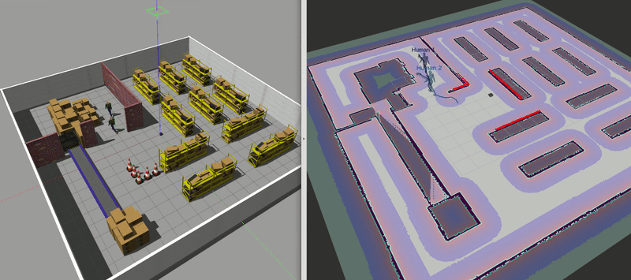

## Contents
- [Quick Start within 3 Minutes](#0)
- [Document](#1)
- [Tool Chains](#2)
- [Version](#3)
- [Acknowledgments](#4)
- [License](#5)
- [Maintenance](#6)

## <span id="0">0. Quick Start within 3 Minutes

*Tested on ubuntu 20.04 LTS with ROS Noetic.*

1. Install [ROS](http://wiki.ros.org/ROS/Installation) (Desktop-Full *suggested*).

2. Install git.
    ```bash
    sudo apt install git
    ```

3. Install dependence

    - OSQP
    ```bash
    git clone -b release-0.6.3 --recursive https://github.com/oxfordcontrol/osqp
    cd osqp && mkdir build && cd build
    cmake .. -DBUILD_SHARED_LIBS=ON
    make -j6
    sudo make install
    ```

    - OSQP-Eigen

    ```bash
    git clone https://github.com/robotology/osqp-eigen.git
    cd osqp-eigen && mkdir build && cd build
    cmake ..
    make
    sudo make install
    ```

    - Other dependence.
    ```bash
    sudo apt install python-is-python3 \
    ros-noetic-amcl \
    ros-noetic-base-local-planner \
    ros-noetic-map-server \
    ros-noetic-move-base \
    ros-noetic-navfn
    ```

4. Clone the reposity.
    ```bash
    git clone https://github.com/ai-winter/ros_motion_planning.git
    ```

5. Compile the code.

   **NOTE: Please refer to [#48](https://github.com/ai-winter/ros_motion_planning/issues/48) if you meet libignition dependency error.**
    ```bash
    cd ros_motion_planning/
    catkin_make
    # or catkin build
    # you may need to install it by: sudo apt install python-catkin-tools
    ```

6. Execute the code.
    ```bash
    cd scripts/
    ./main.sh
    ```

    > NOTE: Modifying launch files may not have any effect, because they are regenerated by a Python script based on `src/user_config/user_config.yaml` when you run `main.sh`. Therefore, you should modify configurations in `user_config.yaml` instead of launch files.

7. Use **2D Nav Goal** in RViz to select the goal.

8.  Moving!

9.  You can use the other script to shutdown them rapidly.
    ```bash
    ./killpro.sh
    ```

## 1. <span id="1">Document

The overall file structure is shown below.

```
ros_motion_planner
├── assets
├── scripts
└── src
    ├── core
    │   ├── global_planner
    │   ├── local_planner
    │   ├── curve_generation
    │   └── utils
    ├── sim_env             # simulation environment
    │   ├── config
    │   ├── launch
    │   ├── maps
    │   ├── meshes
    │   ├── models
    │   ├── rviz
    │   ├── urdf
    │   └── worlds
    ├── third_party
    │   ├── dynamic_rviz_config
    │   ├── dynamic_xml_config
    │   ├── gazebo_plugins
    │   └── rviz_plugins
    └── user_config         # user configure file
```

To better understand the project code, detailed interface documentation can be generated using the doxygen tool. First install doxygen and graphviz.

```bash
sudo apt-get install doxygen graphviz
```

Then start the doxygen and you can find the documentation in `./docs/html/index.html`. 

```bash
doxygen
```

For more information about the project usage, please refer to the following table.

| Index | Document | Introduction |
|:----:|:----:|:----:|
|0|[](https://github.com/ai-winter/ros_motion_planning/blob/master/docs/configuration.md)|Introduce how to dynamically configure parameters such as robot types, planning algorithms, environmental obstacles, etc.
|1|[](https://github.com/ai-winter/ros_motion_planning/blob/master/docs/docker.md)|Introduce how to use Docker to conveniently build the project environment and simulate it.
|2|[](https://github.com/ai-winter/ros_motion_planning/blob/master/docs/realworld.md)|Introduce how to build a real robot application based on the algorithms provided in this repository.
|3|[](https://github.com/ai-winter/ros_motion_planning/blob/master/docs/history.md)|Important updates.

## 02. <span id="2">Tool Chains

For the efficient operation of the motion planning system, we provide a series of user-friendly simulation tools that allow for on-demand selection of these lightweight repositories.

| Tool Version | Introduction |
|:-------:|:---------:|
|[](https://github.com/ai-winter/ros_pedestrians_simulation) | This is a Gazebo plugin for pedestians with collision property. You can construct a dynamic environment in ROS easily using plugin.
|[](https://github.com/ai-winter/path_visualization_plugins)|This repository provides a ROS-based visualization Rviz plugins for path planning and curve generation algorithms.

## <span id="3">03. Version

### Global Planner

|     Planner      |                                                                                            Version                                                                                            |                         Animation                          | Papers
|:----------------:|:---------------------------------------------------------------------------------------------------------------------------------------------------------------------------------------------:|:----------------------------------------------------------:|:---------:|
|     **GBFS**     |      [](https://github.com/ai-winter/ros_motion_planning/blob/master/src/core/global_planner/graph_planner/src/a_star.cpp)       |            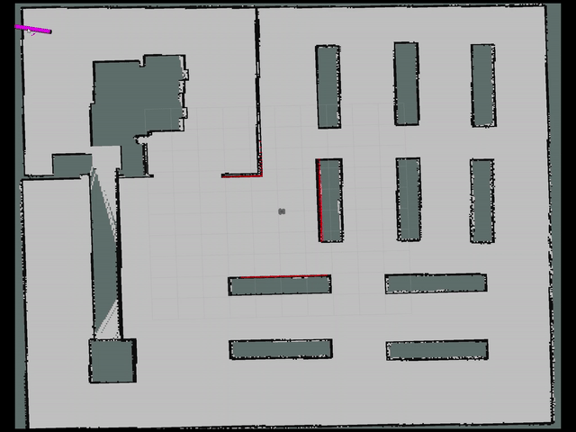            |-
|   **Dijkstra**   |      [](https://github.com/ai-winter/ros_motion_planning/blob/master/src/core/global_planner/graph_planner/src/a_star.cpp)       |        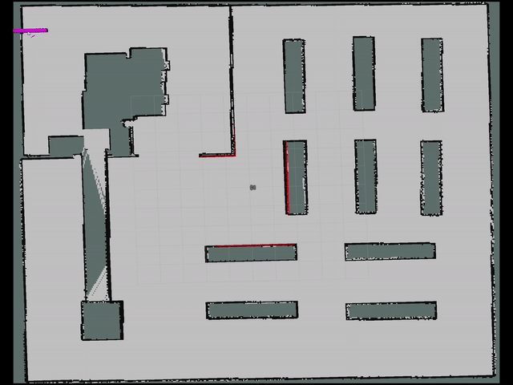        |-
|     **A\***      |      [](https://github.com/ai-winter/ros_motion_planning/blob/master/src/core/global_planner/graph_planner/src/a_star.cpp)       |          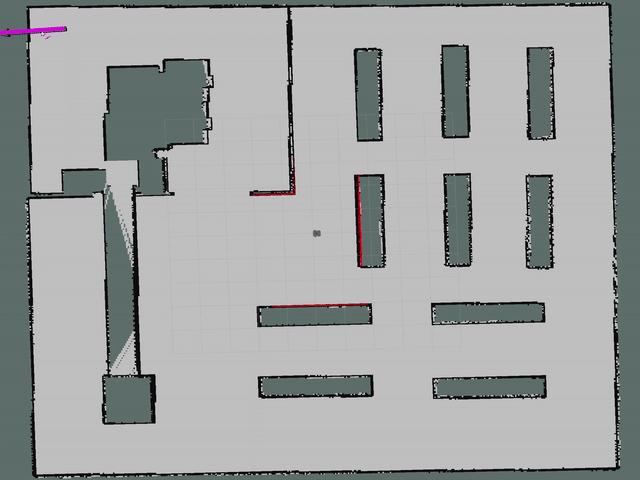          |[A Formal Basis for the heuristic Determination of Minimum Cost Paths](https://ieeexplore.ieee.org/document/4082128)
|     **JPS**      | [](https://github.com/ai-winter/ros_motion_planning/blob/master/src/core/global_planner/graph_planner/src/jump_point_search.cpp) |             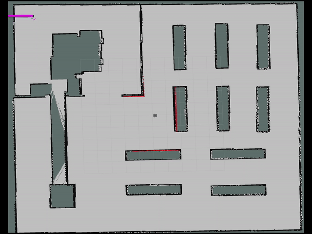             |[Online Graph Pruning for Pathfinding On Grid Maps](https://ojs.aaai.org/index.php/AAAI/article/view/7994)
|     **D\***      |     []((https://github.com/ai-winter/ros_motion_planning/blob/master/src/core/global_planner/graph_planner/src/d_star.cpp))      |          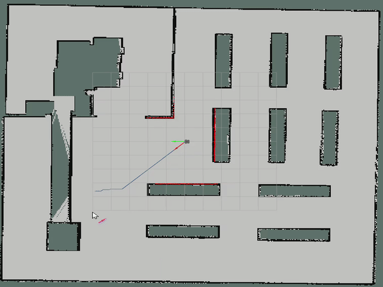          |[Optimal and Efficient Path Planning for Partially-Known Environments](http://web.mit.edu/16.412j/www/html/papers/original_dstar_icra94.pdf)
|    **LPA\***     |    []((https://github.com/ai-winter/ros_motion_planning/blob/master/src/core/global_planner/graph_planner/src/lpa_star.cpp))     |        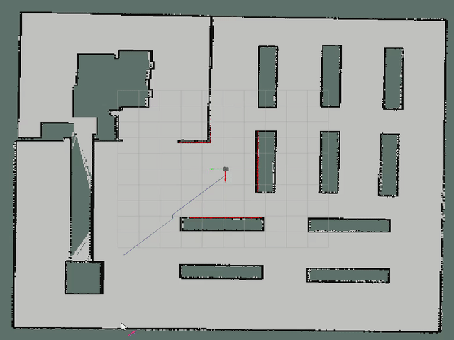        |[Lifelong Planning A*](https://www.cs.cmu.edu/~maxim/files/aij04.pdf)
|   **D\* Lite**   |   []((https://github.com/ai-winter/ros_motion_planning/blob/master/src/core/global_planner/graph_planner/src/d_star_lite.cpp))   |     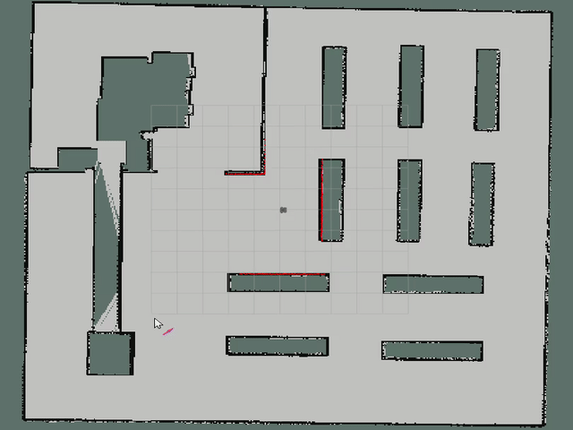     |[D* Lite](http://idm-lab.org/bib/abstracts/papers/aaai02b.pdf)
|   **Voronoi**    |     []((https://github.com/ai-winter/ros_motion_planning/blob/master/src/core/global_planner/graph_planner/src/voronoi.cpp))     |                  |-
|   **Theta\***    |   []((https://github.com/ai-winter/ros_motion_planning/blob/master/src/core/global_planner/graph_planner/src/theta_star.cpp))    |            |[Theta*: Any-Angle Path Planning on Grids](https://www.jair.org/index.php/jair/article/view/10676), [Any-angle path planning on non-uniform costmaps](https://ieeexplore.ieee.org/abstract/document/5979769)
| **Lazy Theta\*** | []((https://github.com/ai-winter/ros_motion_planning/blob/master/src/core/global_planner/graph_planner/src/lazy_theta_star.cpp)) | 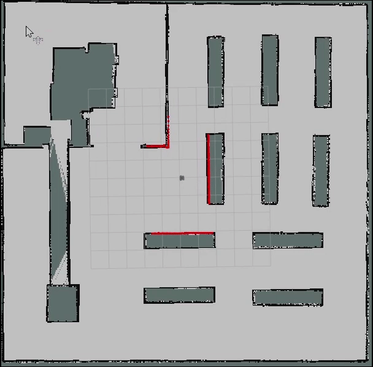 |[Lazy Theta*: Any-Angle Path Planning and Path Length Analysis in 3D](https://ojs.aaai.org/index.php/AAAI/article/view/7566)
|  **S-Theta\***   |  []((https://github.com/ai-winter/ros_motion_planning/blob/master/src/core/global_planner/graph_planner/src/s_theta_star.cpp))   |        |[S-Theta*: low steering path-planning algorithm](https://link.springer.com/chapter/10.1007/978-1-4471-4739-8_8)
|  **Hybrid A\***  |  []((https://github.com/ai-winter/ros_motion_planning/blob/master/src/core/global_planner/graph_planner/src/hybrid_astar.cpp))   |    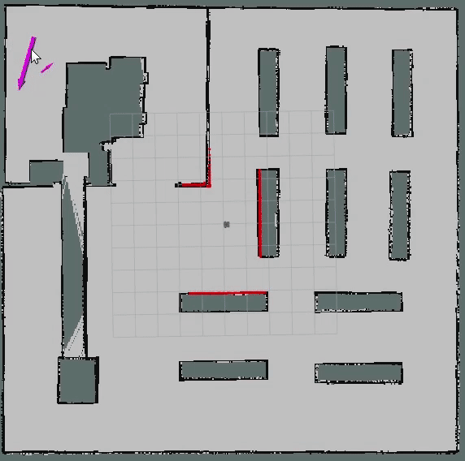    |[Practical search techniques in path planning for autonomous driving](https://ai.stanford.edu/~ddolgov/papers/dolgov_gpp_stair08.pdf)
|     **RRT**      |       [](https://github.com/ai-winter/ros_motion_planning/blob/master/src/core/global_planner/sample_planner/src/rrt.cpp)        |                          |[Rapidly-Exploring Random Trees: A New Tool for Path Planning](http://msl.cs.uiuc.edu/~lavalle/papers/Lav98c.pdf)
|    **RRT\***     |     [](https://github.com/ai-winter/ros_motion_planning/blob/master/src/core/global_planner/sample_planner/src/rrt_star.cpp)     |                |[Sampling-based algorithms for optimal motion planning](https://journals.sagepub.com/doi/abs/10.1177/0278364911406761)
| **Informed RRT** |   [](https://github.com/ai-winter/ros_motion_planning/blob/master/src/core/global_planner/sample_planner/src/informed_rrt.cpp)   |        |[Optimal Sampling-based Path Planning Focused via Direct Sampling of an Admissible Ellipsoidal heuristic](https://arxiv.org/abs/1404.2334)
| **RRT-Connect**  |   [](https://github.com/ai-winter/ros_motion_planning/blob/master/src/core/global_planner/sample_planner/src/rrt_connect.cpp)    |          |[RRT-Connect: An Efficient Approach to Single-Query Path Planning](http://www-cgi.cs.cmu.edu/afs/cs/academic/class/15494-s12/readings/kuffner_icra2000.pdf)
|     **ACO**      |    [](https://github.com/ai-winter/ros_motion_planning/blob/master/src/core/global_planner/evolutionary_planner/src/aco.cpp)     |                          |[Ant Colony Optimization: A New Meta-Heuristic](http://www.cs.yale.edu/homes/lans/readings/routing/dorigo-ants-1999.pdf)
|      **GA**      |     [](https://github.com/ai-winter/ros_motion_planning/blob/master/src/core/global_planner/evolutionary_planner/src/ga.cpp)     |              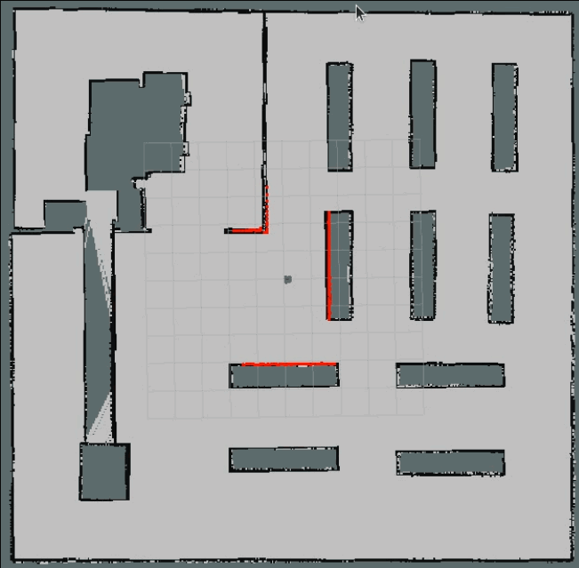              |[Adaptation in Natural and Artificial Systems](https://ieeexplore.ieee.org/book/6267401)
|     **PSO**      |    [](https://github.com/ai-winter/ros_motion_planning/blob/master/src/core/global_planner/evolutionary_planner/src/pso.cpp)     |                          |[Particle Swarm Optimization](https://ieeexplore.ieee.org/document/488968)

### Local Planner

| Planner | Version | Animation |Paper
|:-------:|:-------:|:---------:|:---------:|
|   **PID**   | [](https://github.com/ai-winter/ros_motion_planning/blob/master/src/core/local_planner/pid_planner/src/pid_planner.cpp) |                       | [Mapping Single-Integrator Dynamics to Unicycle Control Commands](https://liwanggt.github.io/files/Robotarium_CSM_Impact.pdf) p. 14
|   **LQR**   | [](https://github.com/ai-winter/ros_motion_planning/blob/master/src/core/local_planner/lqr_planner/src/lqr_planner.cpp) |           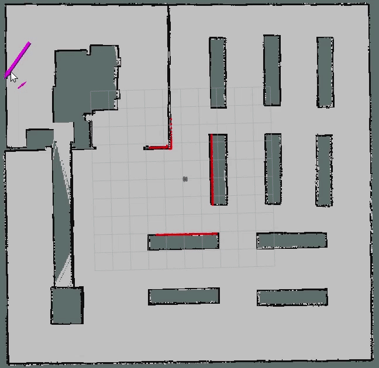            |-
|   **DWA**   |     [](https://github.com/ai-winter/ros_motion_planning/blob/master/src/core/local_planner/dwa_planner/src/dwa.cpp)     |           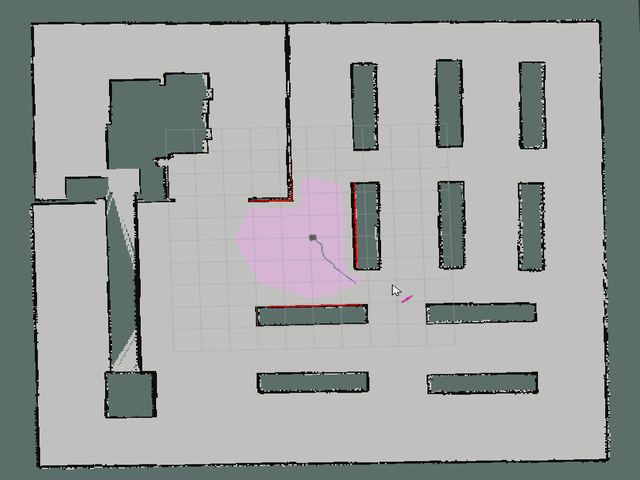            |[The Dynamic Window Approach to Collision Avoidance](https://www.ri.cmu.edu/pub_files/pub1/fox_dieter_1997_1/fox_dieter_1997_1.pdf)
|   **APF**   |     [](https://github.com/ai-winter/ros_motion_planning/blob/master/src/core/local_planner/apf_planner/src/apf_planner.cpp)     | 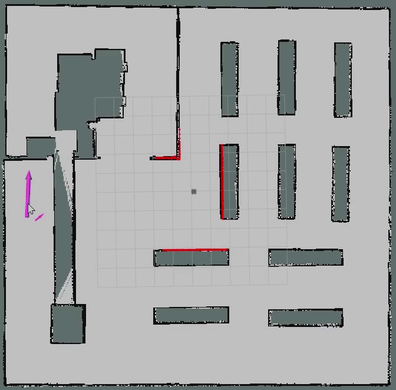|[Real-time obstacle avoidance for manipulators and mobile robots](https://ieeexplore.ieee.org/document/1087247)
|   **RPP**   |     [](https://github.com/ai-winter/ros_motion_planning/blob/master/src/core/local_planner/rpp_planner/src/rpp_planner.cpp)     | 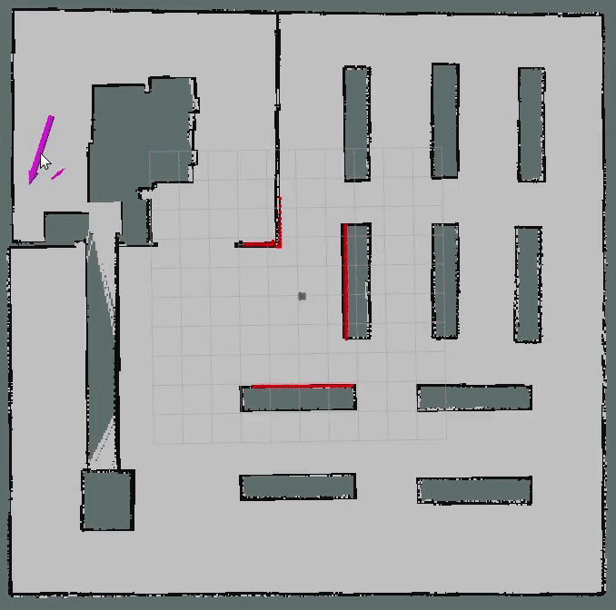|[Regulated Pure Pursuit for Robot Path Tracking](https://arxiv.org/pdf/2305.20026.pdf)
|   **TEB**   |                                                                                                                                 |  |
|   **MPC**   |                                                              [](https://github.com/ai-winter/ros_motion_planning/blob/master/src/core/local_planner/mpc_planner/src/mpc_planner.cpp)     |  | -
| **Lattice** |                                                                                                                                 |  |


### Curve Generation

| Planner | Version | Animation |Paper
|:-------:|:-------:|:---------:|:---------:|
| **Polynomia** | [](https://github.com/ai-winter/ros_motion_planning/blob/master/src/core/curve_generation/src/polynomial_curve.cpp) | 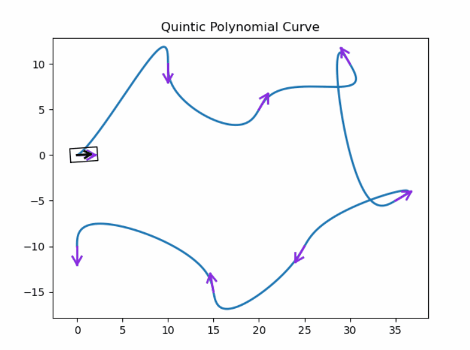|-
| **Bezier** | [](https://github.com/ai-winter/ros_motion_planning/blob/master/src/core/curve_generation/src/bezier_curve.cpp) | 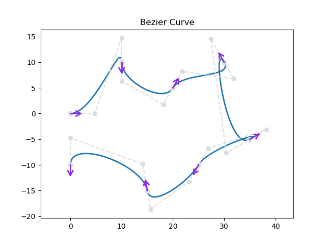|-
| **Cubic Spline** | [](https://github.com/ai-winter/ros_motion_planning/blob/master/src/core/curve_generation/src/cubic_spline.cpp) | 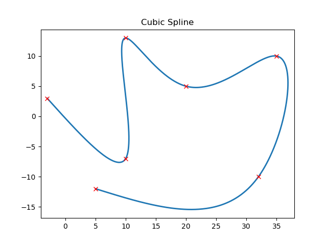|-
| **BSpline** | [](https://github.com/ai-winter/ros_motion_planning/blob/master/src/core/curve_generation/src/bspline_curve.cpp) | 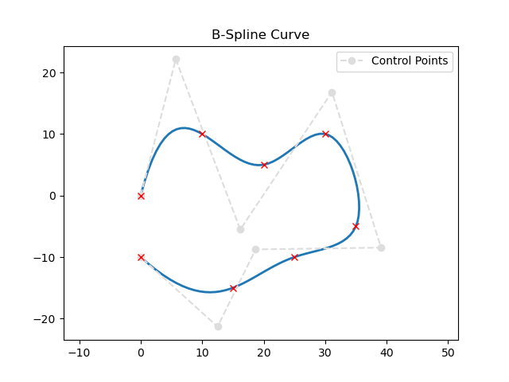 |-
| **Dubins** | [](https://github.com/ai-winter/ros_motion_planning/blob/master/src/core/curve_generation/src/dubins_curve.cpp) | 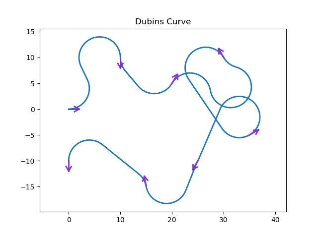|[On curves of minimal length with a constraint on average curvature, and with prescribed initial and terminal positions and tangents]()
| **Reeds-Shepp** | [](https://github.com/ai-winter/ros_motion_planning/blob/master/src/core/curve_generation/src/reeds_shepp.cpp) | 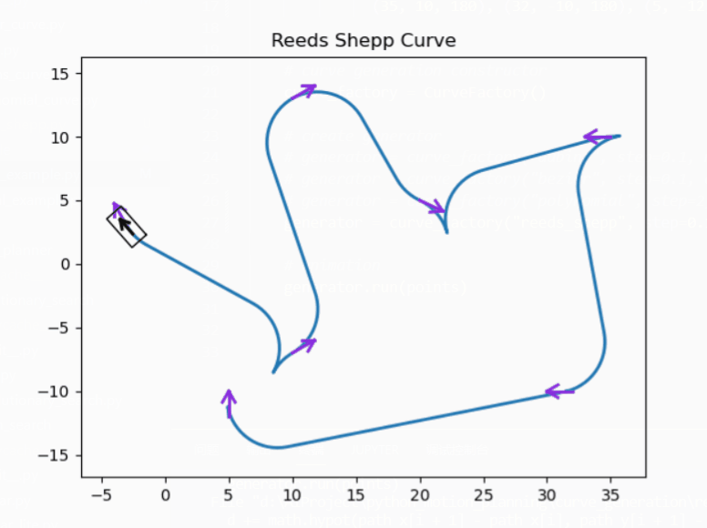|[Optimal paths for a car that goes both forwards and backwards](https://projecteuclid.org/journals/pacific-journal-of-mathematics/volume-145/issue-2/Optimal-paths-for-a-car-that-goes-both-forwards-and/pjm/1102645450.full)


## <span id="4">04. Acknowledgments
* Our robot and world models are from [
Dataset-of-Gazebo-Worlds-Models-and-Maps](https://github.com/mlherd/Dataset-of-Gazebo-Worlds-Models-and-Maps) and [
aws-robomaker-small-warehouse-world](https://github.com/aws-robotics/aws-robomaker-small-warehouse-world). Thanks for these open source models sincerely.

* Pedestrians in this environment are using social force model(sfm), which comes from [https://github.com/robotics-upo/lightsfm](https://github.com/robotics-upo/lightsfm).

* A ROS costmap plugin for [dynamicvoronoi](http://www2.informatik.uni-freiburg.de/~lau/dynamicvoronoi/) presented by Boris Lau.

## <span id="5">05. License

The source code is released under [GPLv3](https://www.gnu.org/licenses/) license.

## <span id="6">06. Maintenance

Feel free to contact us if you have any question.
