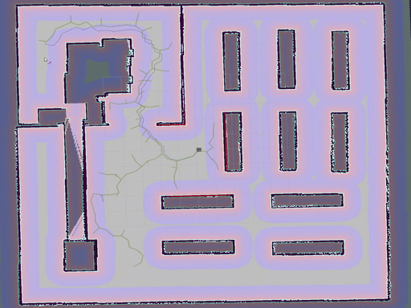

# Introduction

`Motion Planning` plans the state sequence of the robot without conflicts between the start and goal.

`Motion Planning` mainly includes `Path Planning` and `Trajectory Planning`.

* `Path Planning`: Based on path constraints (such as obstacles), it plans the optimal path sequence for the robot to travel without conflicts between the start and goal.
* `Trajectory Planning`: It plans the motion state to approach the global path based on kinematics, dynamics constraints and path sequence.

This repository provides the implement of common `Motion Planning` algorithm, welcome your star, fork and PR.

The theory analysis can be found at [motion-planning](https://blog.csdn.net/frigidwinter/category_11410243.html)

We also provide Matlab Version at 


# Quick Start

To start simulation, compile using `catkin` first. For example, we assume that local workspace name is `~/sim_platform`
```sh
mv ./src ~/sim_platform/
cd ~/sim_platform
catkin_make
```

Edit user configure
```sh
cd user_config
touch user_config.yaml
```

Below is the example of `user_config.yaml`

```yaml
map: "warehouse"
world: "warehouse"
robots_config:
  - robot1_type: "turtlebot3_burger"
    robot1_global_planner: "astar"
    robot1_local_planner: "dwa"
    robot1_x_pos: "0.0"
    robot1_y_pos: "0.0"
    robot1_z_pos: "0.0"
    robot1_yaw: "-1.57"
  - robot2_type: "turtlebot3_burger"
    robot2_global_planner: "jps"
    robot2_local_planner: "pid"
    robot2_x_pos: "-5.0"
    robot2_y_pos: "-7.5"
    robot2_z_pos: "0.0"
    robot2_yaw: "0.0"
robots_init: "robots_rviz_init.yaml"
rviz_file: "sim_env.rviz"
```
explanation:
- map: static map，map files are at `sim_env/sim_env/map/`.
- world: world，world files are at `sim_env/sim_env/worlds/`
- robots_config：robotic confiugre
  - type: robotic type，such as `turtlebot3_burger`、`turtlebot3_waffle`、`turtlebot3_waffle_pi`
  - global_planner: global algorithm, see chapter `Version`
  - local_planner: local algorithm, see chapter `Version`
  - xyz_pos | yaw：initial pose
- robots_init：initial pose in RVIZ
- rviz_file: RVIZ configure, dynamic generation if `rviz_file` is none


Then creat a new terminal and build environment
    
```sh
cd sim_env/sim_env/scripts
./main.sh
```


# Version
## Global Planner

| Planner | Version | Animation
| ------- | --- | ------ | 
| **GBFS** | [](https://github.com/ai-winter/ros_motion_planning/blob/master/src/planner/graph_planner/src/a_star.cpp) |
| **Dijkstra** | [](https://github.com/ai-winter/ros_motion_planning/blob/master/src/planner/graph_planner/src/a_star.cpp)  |
| **A\*** | [](https://github.com/ai-winter/ros_motion_planning/blob/master/src/planner/graph_planner/src/a_star.cpp) | 
| **JPS** | [](https://github.com/ai-winter/ros_motion_planning/blob/master/src/planner/graph_planner/src/jump_point_search.cpp) |  |
| **D\*** | []((https://github.com/ai-winter/ros_motion_planning/blob/master/src/planner/graph_planner/src/d_star.cpp)) | 
| **LPA\*** |  | 
| **D\* Lite** |  | 
| **RRT** | [](https://github.com/ai-winter/ros_motion_planning/blob/master/src/planner/sample_planner/src/rrt.cpp) | 
| **RRT\*** | [](https://github.com/ai-winter/ros_motion_planning/blob/master/src/planner/sample_planner/src/rrt_star.cpp) |
| **Informed RRT** | [](https://github.com/ai-winter/ros_motion_planning/blob/master/src/planner/sample_planner/src/informed_rrt.cpp) | 
| **RRT-Connect** | [](https://github.com/ai-winter/ros_motion_planning/blob/master/src/planner/sample_planner/src/rrt_connect.cpp) | 

## Local Planner
| Planner | Version | Animation
| ------- | --- | ------ 
| **PID** | [](https://github.com/ai-winter/ros_motion_planning/blob/master/src/planner/local_planner/pid_planner/src/pid_planner.cpp) | 
| **APF** |  | 
| **DWA** | [](https://github.com/ai-winter/ros_motion_planning/blob/master/src/planner/local_planner/dwa_planner/src/dwa.cpp) |
| **TEB** |  | 
| **MPC** |  | 
| **Lattice** |  | 

## Intelligent Algorithm

| Planner |Version | Animation
| ------- | --- | ------ 
| **ACO** |  | 
| **GA**  |  | 
| **PSO**  |  | 
| **ABC** |  | 


# Papers
## Search-based Planning
* [A*: ](https://ieeexplore.ieee.org/document/4082128) A Formal Basis for the heuristic Determination of Minimum Cost Paths
* [JPS:](https://ojs.aaai.org/index.php/AAAI/article/view/7994) Online Graph Pruning for Pathfinding On Grid Maps
* [Lifelong Planning A*: ](https://www.cs.cmu.edu/~maxim/files/aij04.pdf) Lifelong Planning A*
* [D*: ](http://web.mit.edu/16.412j/www/html/papers/original_dstar_icra94.pdf) Optimal and Efficient Path Planning for Partially-Known Environments
* [D* Lite: ](http://idm-lab.org/bib/abstracts/papers/aaai02b.pdf) D* Lite

## Sample-based Planning
* [RRT: ](http://msl.cs.uiuc.edu/~lavalle/papers/Lav98c.pdf) Rapidly-Exploring Random Trees: A New Tool for Path Planning
* [RRT-Connect: ](http://www-cgi.cs.cmu.edu/afs/cs/academic/class/15494-s12/readings/kuffner_icra2000.pdf) RRT-Connect: An Efficient Approach to Single-Query Path Planning
* [RRT*: ](https://journals.sagepub.com/doi/abs/10.1177/0278364911406761) Sampling-based algorithms for optimal motion planning
* [Informed RRT*: ](https://arxiv.org/abs/1404.2334) Optimal Sampling-based Path Planning Focused via Direct Sampling of an Admissible Ellipsoidal heuristic

## Local Planning

* [DWA: ](https://www.ri.cmu.edu/pub_files/pub1/fox_dieter_1997_1/fox_dieter_1997_1.pdf) The Dynamic Window Approach to Collision Avoidance

# Update
| Date | Update |
| ---- | ------ |
| 2023.1.13 | cost of motion nodes is set to `NEUTRAL_COST`, which is unequal to that of heuristics, so there is no difference between A* and Dijkstra. This bug has been solved in A* C++ v1.1 |
| 2023.1.18 | update RRT C++ v1.1, adding heuristic judgement when generating random nodes

# Acknowledgment
* Our robot and world models are from [
Dataset-of-Gazebo-Worlds-Models-and-Maps](https://github.com/mlherd/Dataset-of-Gazebo-Worlds-Models-and-Maps) and [
aws-robomaker-small-warehouse-world](https://github.com/aws-robotics/aws-robomaker-small-warehouse-world). Thanks for these open source models sincerely.
