# Introduction

`Motion planning` plans the state sequence of the robot without conflict between the start and goal. 

`Motion planning` mainly includes `Path planning` and `Trajectory planning`.

* `Path Planning`: It's based on path constraints (such as obstacles), planning the optimal path sequence for the robot to travel without conflict between the start and goal.
* `Trajectory planning`: It plans the motion state to approach the global path based on kinematics, dynamics constraints and path sequence.

This repository provides the implement of common `Motion planning` algorithm, welcome your star & fork & PR.

The theory analysis can be found at [motion-planning](https://blog.csdn.net/frigidwinter/category_11410243.html)

# Quick Start

For ROS C++ version, execute the following commands

```shell
cd ./ros
catkin_make
source ./devel/setup.bash
roslaunch sim_env main.launch global_planner:=d_star local_planner:=dwa
```

For python version, open `./python/main.py` and select the algorithm, for example

```python
if __name__ == '__main__':
    '''
    sample search
    '''
    # build environment
    start = (18, 8)
    goal = (37, 18)
    env = Map(51, 31)

    planner = InformedRRT(start, goal, env, max_dist=0.5, r=12, sample_num=1500)

    # animation
    planner.run()
```

For matlab version, open `./matlab/simulation_global.mlx` or `./matlab/simulation_local.mlx` and select the algorithm, for example

```matlab
clear all;
clc;

% load environment
load("gridmap_20x20_scene1.mat");
map_size = size(grid_map);
G = 1;

% start and goal
start = [3, 2];
goal = [18, 29];

% planner
planner_name = "rrt";

planner = str2func(planner_name);
[path, flag, cost, expand] = planner(grid_map, start, goal);

% visualization
clf;
hold on

% plot grid map
plot_grid(grid_map);
% plot expand zone
plot_expand(expand, map_size, G, planner_name);
% plot path
plot_path(path, G);
% plot start and goal
plot_square(start, map_size, G, "#f00");
plot_square(goal, map_size, G, "#15c");
% title
title([planner_name, "cost:" + num2str(cost)]);

hold off
```

# Version
## Global Planner

Planner      |    C++    | Python    | Matlab
------------ | --------- | --------- | -----------------
**GBFS**                 | [](https://github.com/ai-winter/motion_planning/blob/master/ros/src/planner/graph_planner/src/a_star.cpp)   | [](https://github.com/ai-winter/motion_planning/blob/master/python/graph_search/gbfs.py)   | [](https://github.com/ai-winter/motion_planning/blob/master/matlab/graph_search/gbfs.m)   |
**Dijkstra**                 | [](https://github.com/ai-winter/motion_planning/blob/master/ros/src/planner/graph_planner/src/a_star.cpp)  | [](https://github.com/ai-winter/motion_planning/blob/master/python/graph_search/dijkstra.py) | [](https://github.com/ai-winter/motion_planning/blob/master/matlab/graph_search/dijkstra.m) |
**A***                 | [](https://github.com/ai-winter/motion_planning/blob/master/ros/src/planner/graph_planner/src/a_star.cpp) |  | [](https://github.com/ai-winter/motion_planning/blob/master/matlab/graph_search/a_star.m) | 
**JPS**                 | [](https://github.com/ai-winter/motion_planning/blob/master/ros/src/planner/graph_planner/src/jump_point_search.cpp) | [](https://github.com/ai-winter/motion_planning/blob/master/python/graph_search/jps.py) | [](https://github.com/ai-winter/motion_planning/blob/master/matlab/graph_search/jps.m) |
**D***                 |  | [](https://github.com/ai-winter/motion_planning/blob/master/python/graph_search/d_star.py) |  |
**LPA***                 |  | [](https://github.com/ai-winter/motion_planning/blob/master/python/graph_search/lpa_star.py) |  |
**D\* Lite**                 |  | []((https://github.com/ai-winter/motion_planning/blob/master/python/graph_search/d_star_lite.py)) |  |
**RRT**                 | [](https://github.com/ai-winter/motion_planning/blob/master/ros/src/planner/sample_planner/src/rrt.cpp) | [](https://github.com/ai-winter/motion_planning/blob/master/python/sample_search/rrt.py) | [](https://github.com/ai-winter/motion_planning/blob/master/matlab/sample_search/rrt.m) |
**RRT***                 | [](https://github.com/ai-winter/motion_planning/blob/master/ros/src/planner/sample_planner/src/rrt_star.cpp) | [](https://github.com/ai-winter/motion_planning/blob/master/python/sample_search/rrt_star.py) | [](https://github.com/ai-winter/motion_planning/blob/master/matlab/sample_search/rrt_star.m) |
**Informed RRT**                 | [](https://github.com/ai-winter/motion_planning/blob/master/ros/src/planner/sample_planner/src/informed_rrt.cpp) | [](https://github.com/ai-winter/motion_planning/blob/master/python/sample_search/informed_rrt.py) | [](https://github.com/ai-winter/motion_planning/blob/master/matlab/sample_search/informed_rrt.m) |
**RRT-Connect**                 | [](https://github.com/ai-winter/motion_planning/blob/master/ros/src/planner/sample_planner/src/rrt_connect.cpp) | [](https://github.com/ai-winter/motion_planning/blob/master/python/sample_search/rrt_connect.py) | [](https://github.com/ai-winter/motion_planning/blob/master/matlab/sample_search/rrt_connect.m) |

## Local Planner
| Planner | C++                                                      | Python                                                   | Matlab                                                   |
| ------- | -------------------------------------------------------- | -------------------------------------------------------- | -------------------------------------------------------- |
| **PID** |  |  |  |
| **APF** |  |  |  |
| **DWA** | [](https://github.com/ai-winter/motion_planning/blob/master/ros/src/planner/local_planner/dwa_planner/src/dwa.cpp) |  | [](https://github.com/ai-winter/motion_planning/blob/master/matlab/local_planner/dwa.m) |
| **TEB** |  |  |  |
| **MPC** |  |  |  |
| **Lattice** |  |  |  |

## Intelligent Algorithm

| Planner | C++                                                      | Python                                                   | Matlab                                                   |
| ------- | -------------------------------------------------------- | -------------------------------------------------------- | -------------------------------------------------------- |
| **ACO** |  |  |  |
| **GA**  |  |  |  |
| **PSO**  |  |  |  |
| **ABC** |  |  |  |


# Animation

## Global Planner

Planner      |    C++    | Python    | Matlab
------------ | --------- | --------- | -----------------
**GBFS**                 |    | 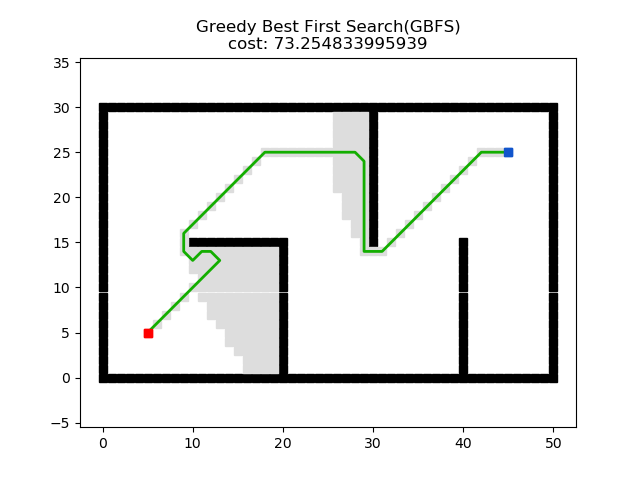   | 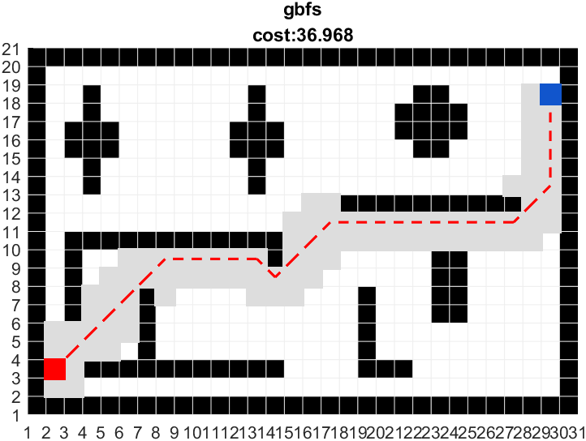  |
**Dijkstra**                 |   |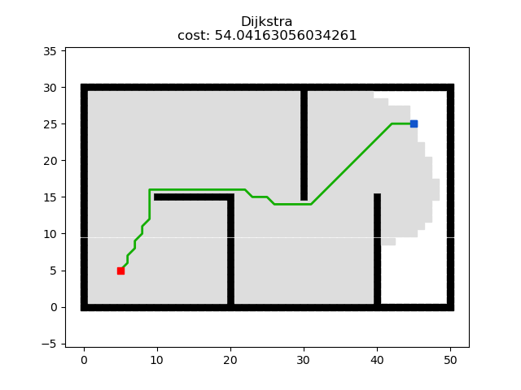 | 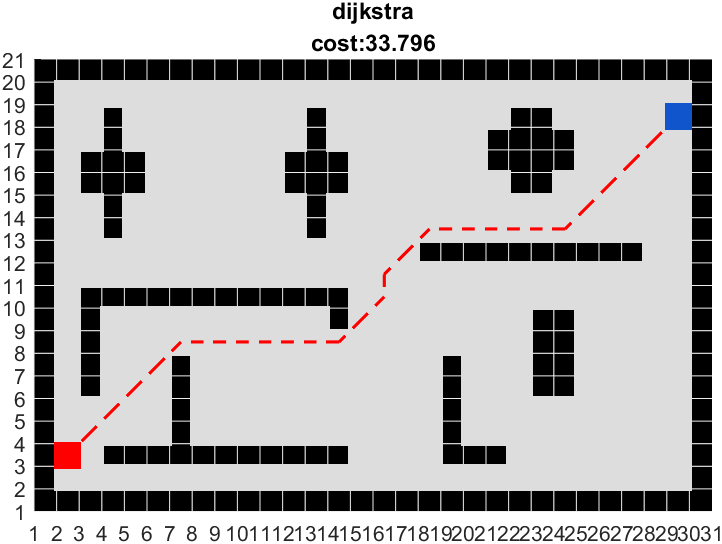 |
**A***                 |  | 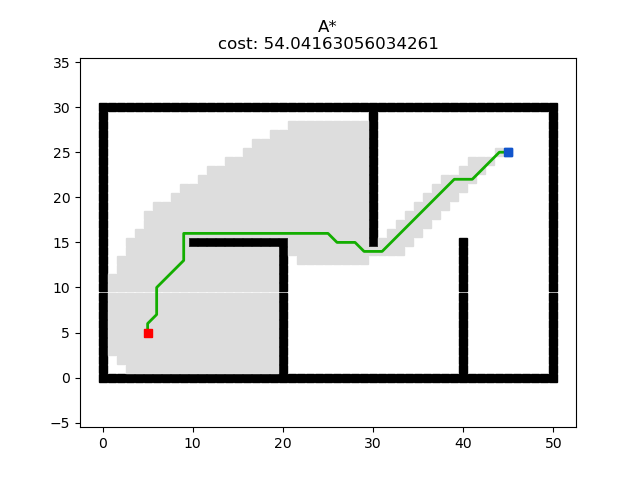 | 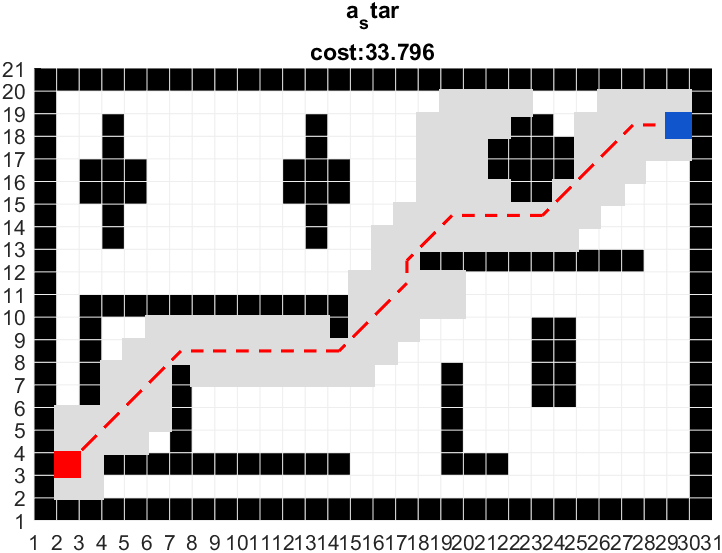| 
**JPS**                 |  | | 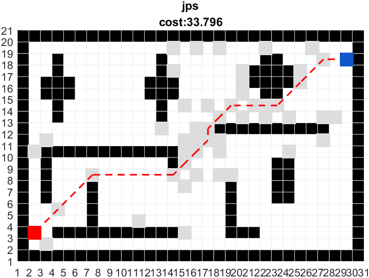 |
**D***                 |  | 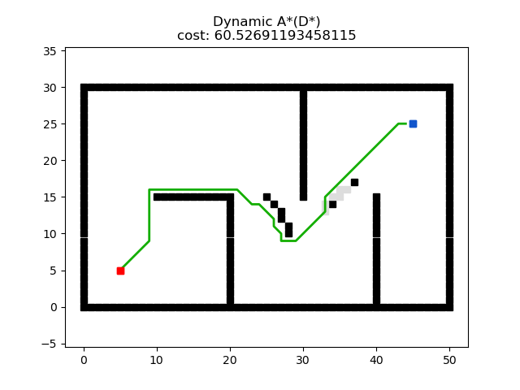| |
**LPA***                 |  | 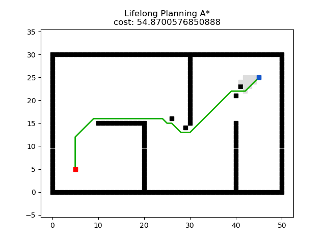 |  |
**D\* Lite**                 |  | 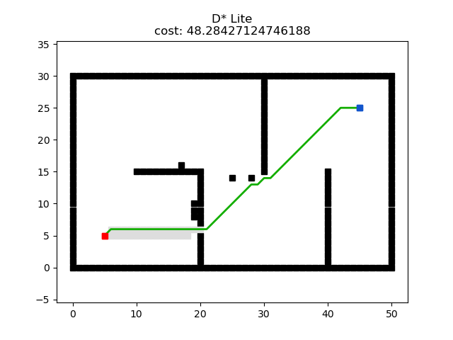 | |
**RRT**                 |  | 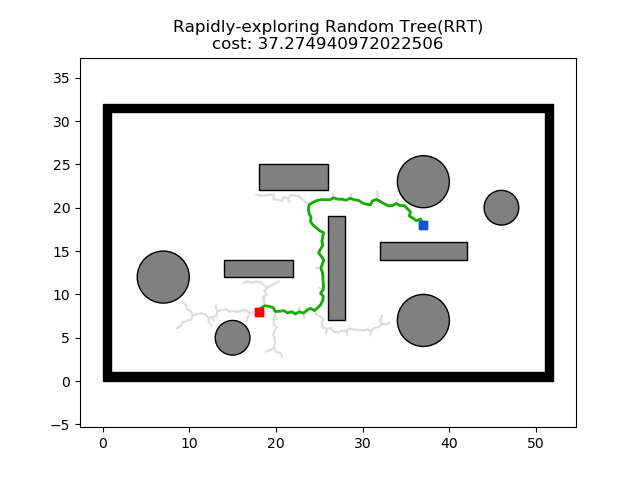 | 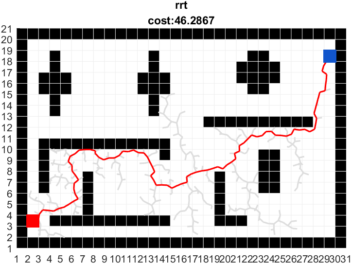 |
**RRT***                 | | 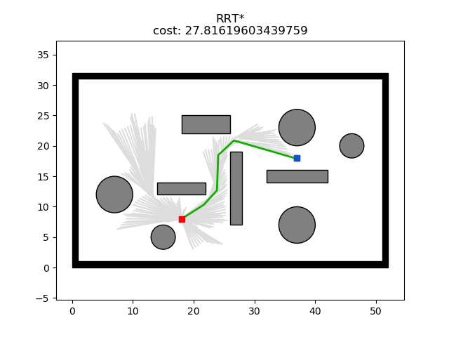 | 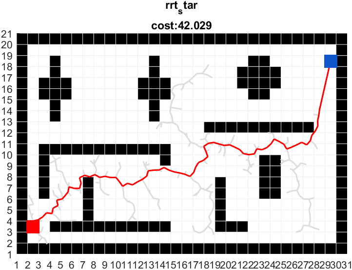|
**Informed RRT**                 |  | 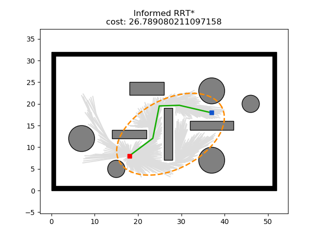 | 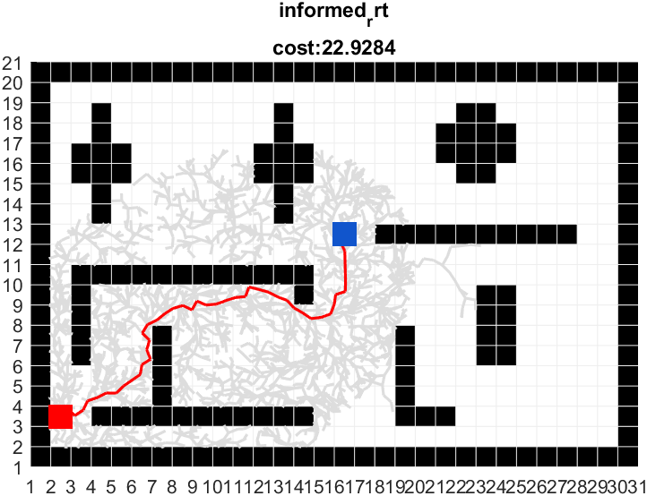 |
**RRT-Connect**                 |  | 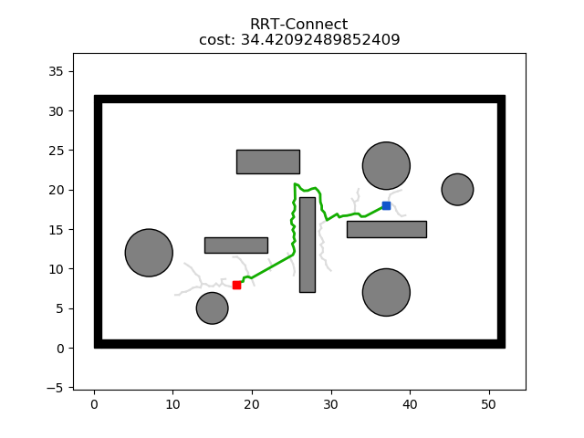 | 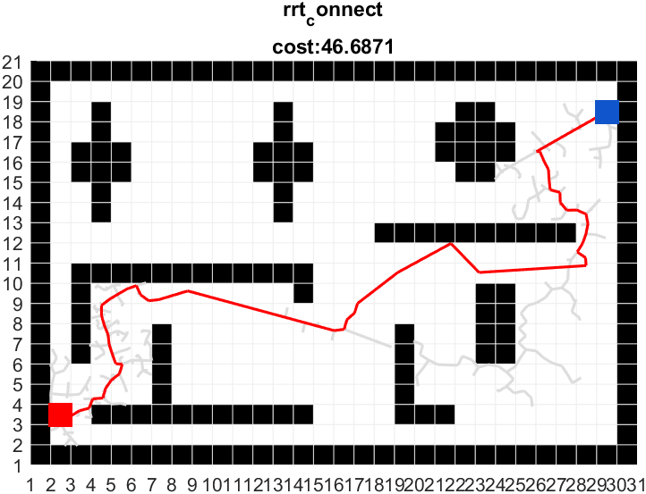 |


## Local Planner
| Planner | C++                                                      | Python                                                   | Matlab                                                   |
| ------- | -------------------------------------------------------- | -------------------------------------------------------- | -------------------------------------------------------- |
| **PID** |  |  |  |
| **APF** |  |  |  |
| **DWA** |  |  | 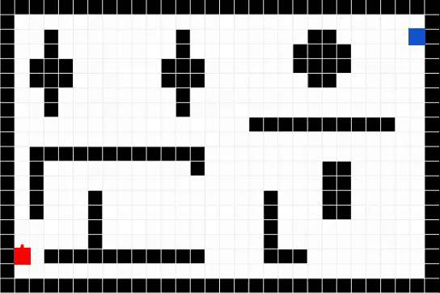 | 


# Papers
## Search-based Planning
* [A*: ](https://ieeexplore.ieee.org/document/4082128) A Formal Basis for the heuristic Determination of Minimum Cost Paths
* [JPS:](https://ojs.aaai.org/index.php/AAAI/article/view/7994) Online Graph Pruning for Pathfinding On Grid Maps
* [Lifelong Planning A*: ](https://www.cs.cmu.edu/~maxim/files/aij04.pdf) Lifelong Planning A*
* [D*: ](http://web.mit.edu/16.412j/www/html/papers/original_dstar_icra94.pdf) Optimal and Efficient Path Planning for Partially-Known Environments
* [D* Lite: ](http://idm-lab.org/bib/abstracts/papers/aaai02b.pdf) D* Lite

## Sample-based Planning
* [RRT: ](http://msl.cs.uiuc.edu/~lavalle/papers/Lav98c.pdf) Rapidly-Exploring Random Trees: A New Tool for Path Planning
* [RRT-Connect: ](http://www-cgi.cs.cmu.edu/afs/cs/academic/class/15494-s12/readings/kuffner_icra2000.pdf) RRT-Connect: An Efficient Approach to Single-Query Path Planning
* [RRT*: ](https://journals.sagepub.com/doi/abs/10.1177/0278364911406761) Sampling-based algorithms for optimal motion planning
* [Informed RRT*: ](https://arxiv.org/abs/1404.2334) Optimal Sampling-based Path Planning Focused via Direct Sampling of an Admissible Ellipsoidal heuristic

## Local Planning

* [DWA: ](https://www.ri.cmu.edu/pub_files/pub1/fox_dieter_1997_1/fox_dieter_1997_1.pdf) The Dynamic Window Approach to Collision Avoidance

# Update
| Date      | Update                                                                                                                                                                        |
| --------- | ----------------------------------------------------------------------------------------------------------------------------------------------------------------------------- |
| 2023.1.13 | cost of motion nodes is set to `NEUTRAL_COST`, which is unequal to that of heuristics, so there is no difference between A* and Dijkstra. This bug has been solved in A* C++ v1.1 |
|2023.1.18| update RRT C++ v1.1, adding heuristic judgement when generating random nodes

# Acknowledgment
* Our robot and world models are from [
Dataset-of-Gazebo-Worlds-Models-and-Maps](https://github.com/mlherd/Dataset-of-Gazebo-Worlds-Models-and-Maps) and [
aws-robomaker-small-warehouse-world](https://github.com/aws-robotics/aws-robomaker-small-warehouse-world). Thanks for these open source models sincerely.
* Our visualization and animation framework of Python Version refers to [https://github.com/zhm-real/PathPlanning](https://github.com/zhm-real/PathPlanning). Thanks sincerely.