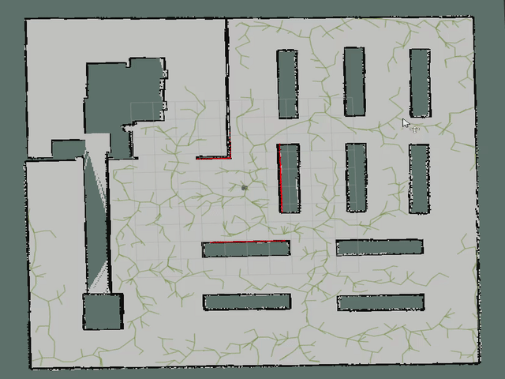
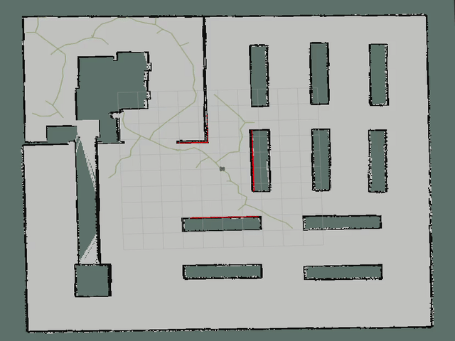

# Introduction

`Motion Planning` plans the state sequence of the robot without conflicts between the start and goal.

`Motion Planning` mainly includes `Path Planning` and `Trajectory Planning`.

* `Path Planning`: Based on path constraints (such as obstacles), it plans the optimal path sequence for the robot to travel without conflicts between the start and goal.

* `Trajectory Planning`: Base on kinematics, dynamics constraints and path sequence, it plans the motion state to approach the global path.

This repository provides the implement of common `Motion Planning` algorithms. Welcome your star, fork and PR!

The theory analysis can be found at [motion-planning](https://blog.csdn.net/frigidwinter/category_11410243.html).
 
We also provide [Python](https://github.com/ai-winter/python_motion_planning) and [MATLAB](https://github.com/ai-winter/matlab_motion_planning) version.


# Quick Start

The file structure is shown below.

```
ros_motion_planner
├─gif                     # Animation for README
└─src
    ├─planner
    │  ├─global_utils     # global planner tools
    │  ├─graph_planner    # global algorithm based on graph searching
    │  ├─sample_planner   # global algorithm based on sample searching
    │  └─local_planner    # local algorithm
    ├─sim_env             # simulation environment
    │  ├─config
    │  ├─launch
    │  ├─maps
    │  ├─meshes
    │  ├─models
    │  ├─rviz
    │  ├─scripts
    │  ├─urdf
    │  └─worlds
    ├─third_party
    └─user_config         # user configure file
```

To start simulation, compile using `catkin_make`. You can directly using this folder as workspace.
```bash
cd ros_motion_planning/
catkin_make
```

Or, we assume that your workspace is `~/sim_platform/`.
```sh
cd ros_motion_planning/
mv src/ ~/sim_platform/
cd ~/sim_platform/
catkin_make
```

Edit user configure
```sh
cd src/user_config/
touch user_config.yaml
```

Below is the example of `user_config.yaml`

```yaml
map: "warehouse"
world: "warehouse"
robots_config:
  - robot1_type: "turtlebot3_burger"
    robot1_global_planner: "astar"
    robot1_local_planner: "dwa"
    robot1_x_pos: "0.0"
    robot1_y_pos: "0.0"
    robot1_z_pos: "0.0"
    robot1_yaw: "-1.57"
  - robot2_type: "turtlebot3_burger"
    robot2_global_planner: "jps"
    robot2_local_planner: "pid"
    robot2_x_pos: "-5.0"
    robot2_y_pos: "-7.5"
    robot2_z_pos: "0.0"
    robot2_yaw: "0.0"
robots_init: "robots_rviz_init.yaml"
rviz_file: "sim_env.rviz"
pedestrians: "pedestrian_config.yaml"
```

Explanation:
- map: static map，located in `src/sim_env/map/`, if `map: ""`, map_server will not publish map message which often used in SLAM.
- world: gazebo world，located in `src/sim_env/worlds/`, if `world: ""`, Gazebo will be disabled which often used in real world.
- robots_config：robotic configuration.
  - type: robotic type，such as `turtlebot3_burger`, `turtlebot3_waffle` and `turtlebot3_waffle_pi`.
  - global_planner: global algorithm, details in Section `Version`.
  - local_planner: local algorithm, details in Section `Version`.
  - xyz_pos and yaw：initial pose.
- robots_init：initial pose in RVIZ.
- rviz_file: RVIZ configure, automatically generated if `rviz_file` is not set.
- pedestrians: configure file to add dynamic obstacles(e.g. pedestrians).

Then create a new terminal and build the environment.
    
```sh
cd src/sim_env/scripts/
./main.sh
```

# Version

## Global Planner

| Planner | Version | Animation |
| :-----: | :-----: | :-------: |
| **GBFS** | [](https://github.com/ai-winter/ros_motion_planning/blob/master/src/planner/graph_planner/src/a_star.cpp) | |
| **Dijkstra** | [](https://github.com/ai-winter/ros_motion_planning/blob/master/src/planner/graph_planner/src/a_star.cpp)  | |
| **A\*** | [](https://github.com/ai-winter/ros_motion_planning/blob/master/src/planner/graph_planner/src/a_star.cpp) |  |
| **JPS** | [](https://github.com/ai-winter/ros_motion_planning/blob/master/src/planner/graph_planner/src/jump_point_search.cpp) |  |
| **D\*** | []((https://github.com/ai-winter/ros_motion_planning/blob/master/src/planner/graph_planner/src/d_star.cpp)) |  |
| **LPA\*** | []((https://github.com/ai-winter/ros_motion_planning/blob/master/src/planner/graph_planner/src/lpa_star.cpp)) |  |
| **D\* Lite** | []((https://github.com/ai-winter/ros_motion_planning/blob/master/src/planner/graph_planner/src/d_star_lite.cpp)) |  |
| **RRT** | [](https://github.com/ai-winter/ros_motion_planning/blob/master/src/planner/sample_planner/src/rrt.cpp) |  |
| **RRT\*** | [](https://github.com/ai-winter/ros_motion_planning/blob/master/src/planner/sample_planner/src/rrt_star.cpp) |  |
| **Informed RRT** | [](https://github.com/ai-winter/ros_motion_planning/blob/master/src/planner/sample_planner/src/informed_rrt.cpp) |  |
| **RRT-Connect** | [](https://github.com/ai-winter/ros_motion_planning/blob/master/src/planner/sample_planner/src/rrt_connect.cpp) |  |

## Local Planner

| Planner | Version | Animation |
| :-----: | :-----: | :-------: |
| **PID** | [](https://github.com/ai-winter/ros_motion_planning/blob/master/src/planner/local_planner/pid_planner/src/pid_planner.cpp) |  |
| **APF** |  |  |
| **DWA** | [](https://github.com/ai-winter/ros_motion_planning/blob/master/src/planner/local_planner/dwa_planner/src/dwa.cpp) |  |
| **TEB** |  |  |
| **MPC** |  |  |
| **Lattice** |  |  |

## Intelligent Algorithm

| Planner | Version | Animation |
| :-----: | :-----: | :-------: | 
| **ACO** |  |  |
| **GA**  |  |  |
| **PSO**  |  |  |
| **ABC** |  |  |

# Papers

## Search-based Planning

* A*: [A Formal Basis for the heuristic Determination of Minimum Cost Paths](https://ieeexplore.ieee.org/document/4082128).
* JPS: [Online Graph Pruning for Pathfinding On Grid Maps](https://ojs.aaai.org/index.php/AAAI/article/view/7994).
* Lifelong Planning A*: [Lifelong Planning A*](https://www.cs.cmu.edu/~maxim/files/aij04.pdf).
* D*: [Optimal and Efficient Path Planning for Partially-Known Environments](http://web.mit.edu/16.412j/www/html/papers/original_dstar_icra94.pdf).
* D* Lite: [D* Lite](http://idm-lab.org/bib/abstracts/papers/aaai02b.pdf).

## Sample-based Planning
* RRT: [Rapidly-Exploring Random Trees: A New Tool for Path Planning](http://msl.cs.uiuc.edu/~lavalle/papers/Lav98c.pdf).
* RRT-Connect: [RRT-Connect: An Efficient Approach to Single-Query Path Planning](http://www-cgi.cs.cmu.edu/afs/cs/academic/class/15494-s12/readings/kuffner_icra2000.pdf).
* RRT*: [Sampling-based algorithms for optimal motion planning](https://journals.sagepub.com/doi/abs/10.1177/0278364911406761).
* Informed RRT*: [Optimal Sampling-based Path Planning Focused via Direct Sampling of an Admissible Ellipsoidal heuristic](https://arxiv.org/abs/1404.2334).

## Local Planning

* DWA: [The Dynamic Window Approach to Collision Avoidance](https://www.ri.cmu.edu/pub_files/pub1/fox_dieter_1997_1/fox_dieter_1997_1.pdf).

# Update
| Date | Update |
| :--: | ------ |
| 2023.1.13 | cost of motion nodes is set to `NEUTRAL_COST`, which is unequal to that of heuristics, so there is no difference between A* and Dijkstra. This bug has been solved in A* C++ v1.1 |
| 2023.1.18 | update RRT C++ v1.1, adding heuristic judgement when generating random nodes |
| 2023.2.25 | update PID C++ v1.1, making desired theta the weighted combination of theta error and theta on the trajectory |
| 2023.3.16| support dynamic simulation environment, user can add pedestrians by modifing `pedestrian_config.yaml`

# Acknowledgment
* Our robot and world models are from [
Dataset-of-Gazebo-Worlds-Models-and-Maps](https://github.com/mlherd/Dataset-of-Gazebo-Worlds-Models-and-Maps) and [
aws-robomaker-small-warehouse-world](https://github.com/aws-robotics/aws-robomaker-small-warehouse-world). Thanks for these open source models sincerely.
* The pedestrians in environment are using social force model(sfm), which comes from [https://github.com/robotics-upo/lightsfm](https://github.com/robotics-upo/lightsfm)